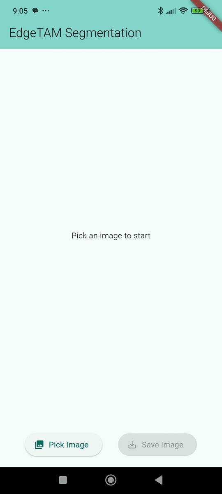

# Flutter Segment Anything: On-Device Image Segmentation

A Flutter mobile application that performs interactive, on-device image segmentation using the **EdgeTAM model**. Users can select an image from their gallery, tap on an object to create a segmentation mask, and then refine the mask by filling holes or removing small, isolated regions. The final result can be saved as a new image with a transparent background. This project demonstrates the power of running complex deep learning models directly on mobile devices using Flutter and the ONNX Runtime

## Screenshots



## Features

* 📷 **Pick from Gallery:** Select any image from your device's photo library.

* 👆 **Interactive Segmentation:** Tap on any object in the image to generate a precise segmentation mask.

* ➕➖ **Refine with Points:** Use positive (include) and negative (exclude) points to fine-tune the mask.

* 🧹 **Mask Post-Processing:** Toggle options to automatically fill holes in the mask or remove small, isolated islands for a cleaner result.

* 🔎 **Zoom & Pan:** Pinch to zoom and drag to pan the image for more precise tapping on small objects.

* ⚡ **On-Device Inference:** All processing is done locally on the device; no server or internet connection is required.

* ✨ **Transparent Cutouts:** Save the segmented object as a new PNG image with a fully transparent background.

* 🏷️ **Metadata Tagging:** Optionally add a "class name" (e.g., "cat", "person") to the saved PNG's metadata for future use.

* 📱 **Cross-Platform:** Built with Flutter for both Android and iOS.


## Model Used

This application uses EdgeTAM, a version of the Track Anything Model (TAM) that is highly optimized for efficient, real-time performance on edge devices. EdgeTAM is based on the **Segment Anything Model 2 (SAM2)**.

The original PyTorch model has been converted into two separate **ONNX (Open Neural Network Exchange)** files for this project:

* `edgetam_encoder.onnx`: Pre-processes the image into feature embeddings.

* `edgetam_decoder.onnx`: Takes the embeddings and a user's tap coordinates to predict the mask.

This two-part structure allows for efficient processing: the heavy encoding step is run only once per image, while the lightweight decoding step can be run multiple times for different user inputs.

For more information on the model, please see the official [EdgeTAM repository](https://github.com/facebookresearch/EdgeTAM).

## Technology Stack

* **Framework:** Flutter
* **ML Inference:** `flutter_onnxruntime`
* **Image Saving:** `gal`
* **Image Processing & Morphology:** `image`, `opencv_dart`
* **Coordinate Transformation:** `vector_math`
* **State Management:** `StatefulWidget` (built-in)

## Getting Started

Follow these instructions to get a copy of the project up and running on your local machine.
### Prerequisites
* An installed and configured **Flutter SDK** (version 3.x or higher).
* A physical device or emulator for Android or iOS.

### Setup

1. **Clone the repository:**

    ```bash
    git clone https://github.com/IoT-gamer/flutter_segment_anything_app.git
    cd flutter_segment_anything_app
    ```
2. **Generate ONNX Models:**

    Use [edgetam_onnx_export.ipynb](https://github.com/IoT-gamer/segment-anything-dinov3-onnx/blob/main/notebooks/edgetam_onnx_export.ipynb) notebook to export the EdgeTAM model to ONNX format. Ensure you have the required dependencies installed in your Python environment or open the notebook in Google Colab.

3. **Place ONNX Models:**
    
    Download or generate the `edgetam_encoder.onnx` and `edgetam_decoder.onnx` files. Place them inside the `assets/models/` directory in the project root.

4. **Configure OpenCV:**

    To minimize app size, `opencv_dart` requires you to specify which native modules you need. Add the following to your `pubspec.yaml`:
    ```yaml
    hooks:
      user_defines:
        dartcv4:
          include_modules:
            - core      # Always required for basic structures like cv.Mat
            - imgproc   # Needed for morphologyEx, getStructuringElement, etc.
            - imgcodecs # Needed for imdecode
    ```

4. **Install dependencies:**

    ```bash
    flutter pub get
    ```
5. **Configure Platform Permissions:**

    You must add permission descriptions to the native platform configuration files to allow the app to save images to the photo gallery.

    * **iOS** (`ios/Runner/Info.plist`):
    Add the following key-string pair:
        ```xml
        <key>NSPhotoLibraryAddUsageDescription</key>
        <string>This app needs access to your photo library to save segmented images.</string>
        ```
    * **Android** (`android/app/src/main/AndroidManifest.xml`):
    Add the following permissions:
        ```xml
        <uses-permission android:name="android.permission.WRITE_EXTERNAL_STORAGE" android:maxSdkVersion="28" />
        <application android:requestLegacyExternalStorage="true">
        ```

6. **Run the app:**

    ```bash
    flutter run
    ```

## How to Use

1. Launch the app.

2. Tap the **"Pick Image"** button and select a photo from your gallery.

3. Once the image is displayed, you can pinch to zoom or drag to pan for a better view.

4. Tap on the object you want to segment. A green mask will overlay the initial result.

5. Use the floating buttons to switch between adding **positive (include) points** and **negative (exclude) points**.

6. Continue tapping on the image to refine the mask. Add positive points to areas the mask missed, or negative points to remove unwanted areas.

7. After the first point is added, post-processing toggles like **"Fill Holes"**, **"Remove Islands"**, and **"Select Largest Area"** will appear at the bottom. Use these to clean up the final mask. The mask updates automatically.

8. Optionally, type a class name (e.g., "cat", "person") into the text field that appears at the bottom.

9. If you are happy with the result, tap the **"Save Image"** button.

10. The app will save a new PNG file to your gallery containing only the segmented object with a transparent background.

## Acknowledgments

* This project is heavily reliant on the research and models provided by the Meta AI Research team in their [EdgeTAM project](https://github.com/facebookresearch/EdgeTAM).

* Inference is made possible by the `flutter_onnxruntime` package.

* Saving to the gallery is handled by the `gal` package.

